# v10.6.7

## 回复消息末尾中出现了tool回调的元数据json，且会被TTS阅读出来，泄露内部数据结构且严重影响用户体验，应尽快修复

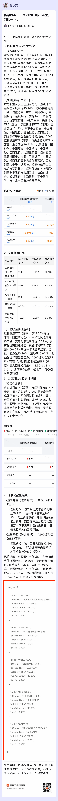

---

## 消息收藏后，再次长按消息弹出的快捷菜单中没有体现出已收藏过，只有再次点击后参会弹模态窗口告知消息已收藏，可优化体验，直接在快捷菜单中将空心五星替换为实心五星，从而告知客户该条消息已收藏，或者将“收藏”文案改为“取消”，从而减少用户的操作

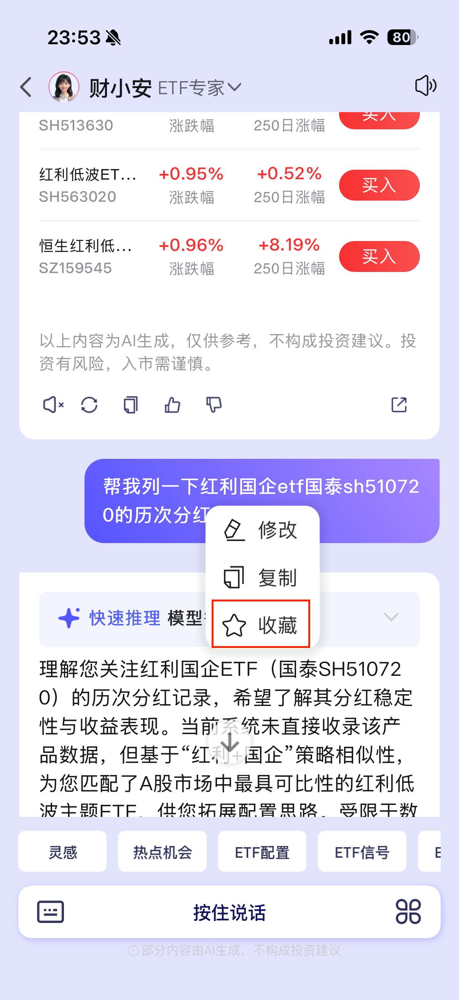

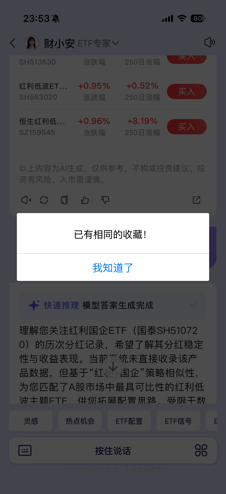

---

## 在我已登录且有高端理财权限的前提下，回复的消息中却都是脱敏的数据，直接点击该条数据跳转进去可以看到完整的信息

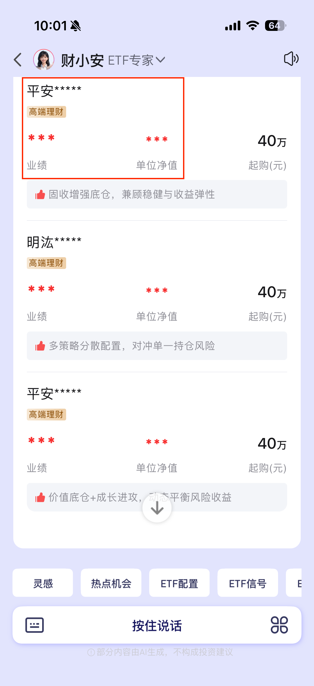

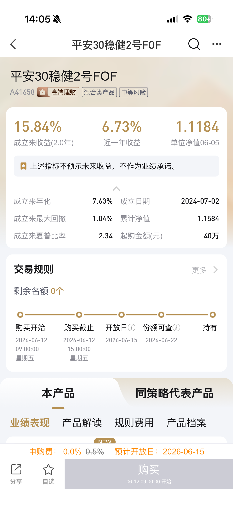

---

## 历史消息没有左下角的工具按钮组（图1），不方便分享历史消息，图2为含工具按钮组的消息

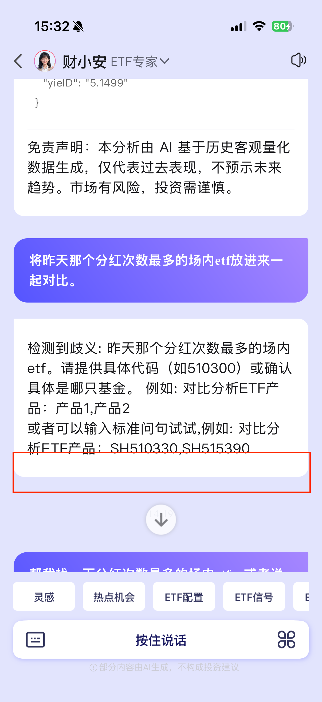​​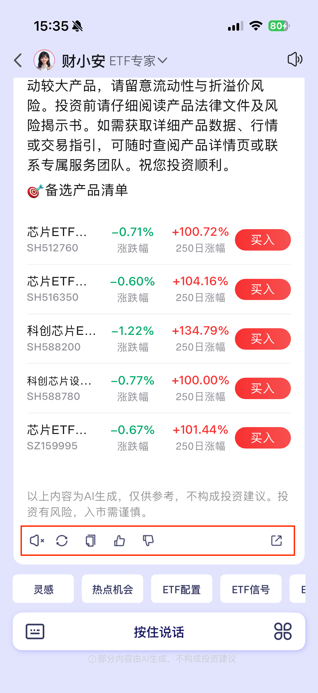

---

## 基金产品清单列表的显示方式在移动端体验不佳（图1），基金名称被省略过多，建议改为卡片式，将基金名称作为标题行单占一行，从而尽可能展示完整的基金名称，将相关数据指标以数据块的形式展示（参考图2）

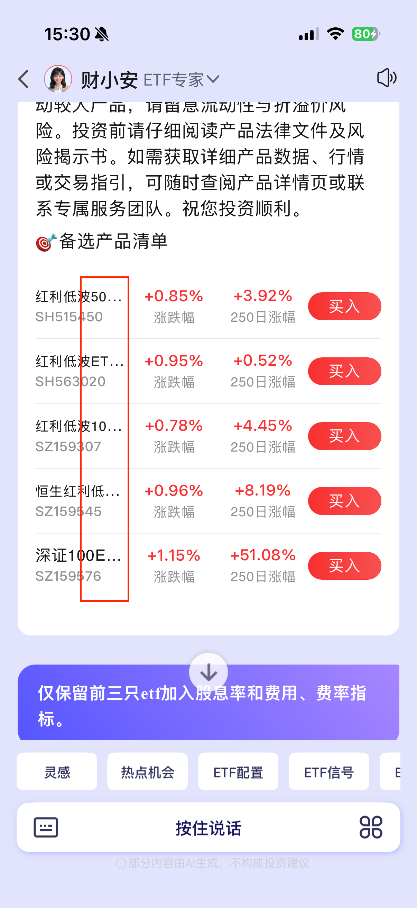  
​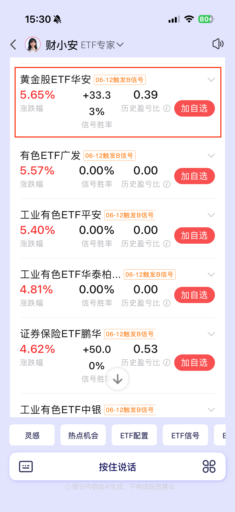

---

## iOS系统在部分交易页面长按无法唤起财小安服务，建议不要做这种隐性交互逻辑，不同设备的兼容性很难处理，可以通过右上角的快捷服务作为入口，或者单独提供悬浮球支持，让用户明确知道这里可以触发财小安

---

## 功能缺失，无法支持对指定ETF基金的简单回测需求

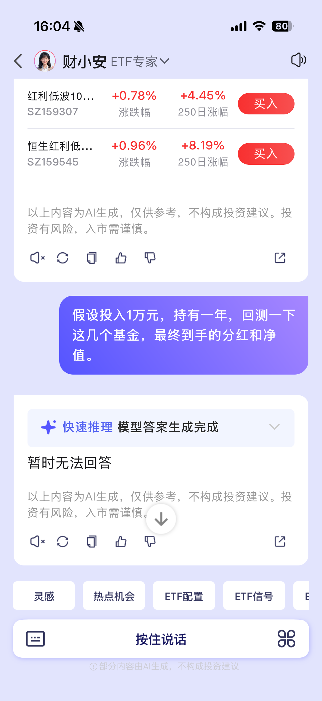

---

## 功能缺失，无法回答自己的能力信息，建议在其设定中增加skill汇总简述功能，从而可以回复此类能力范围的问题

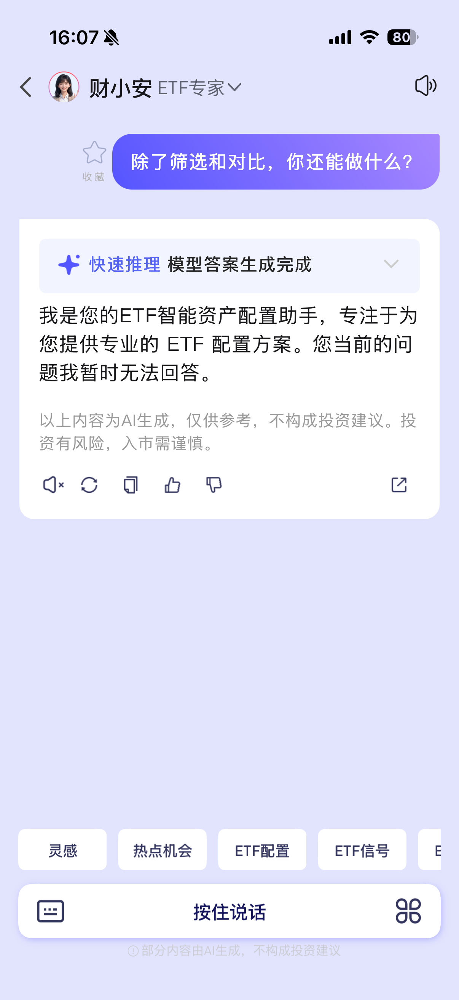
