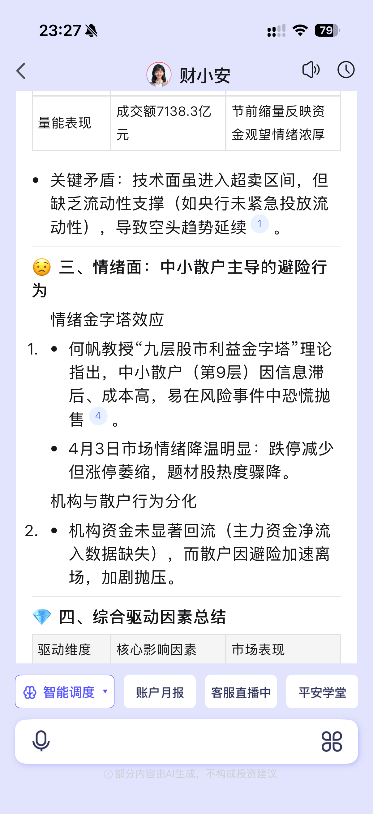
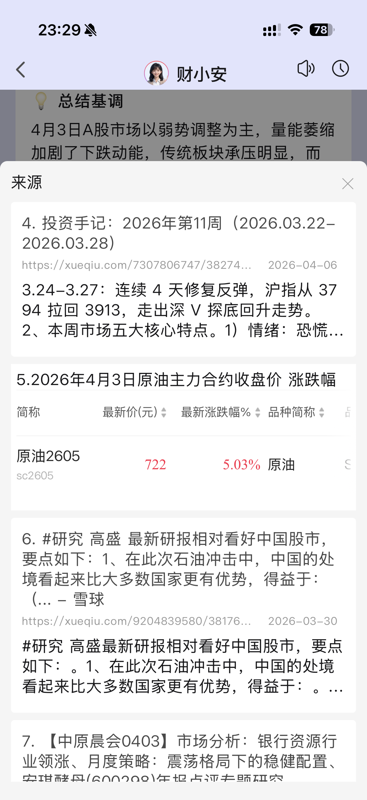
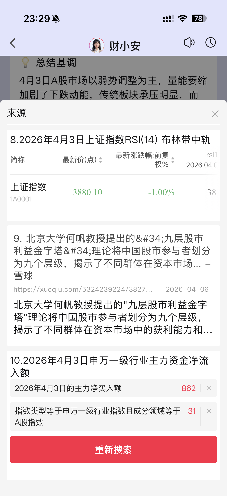
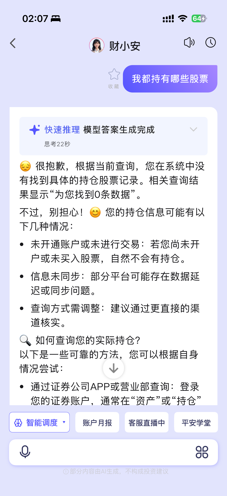
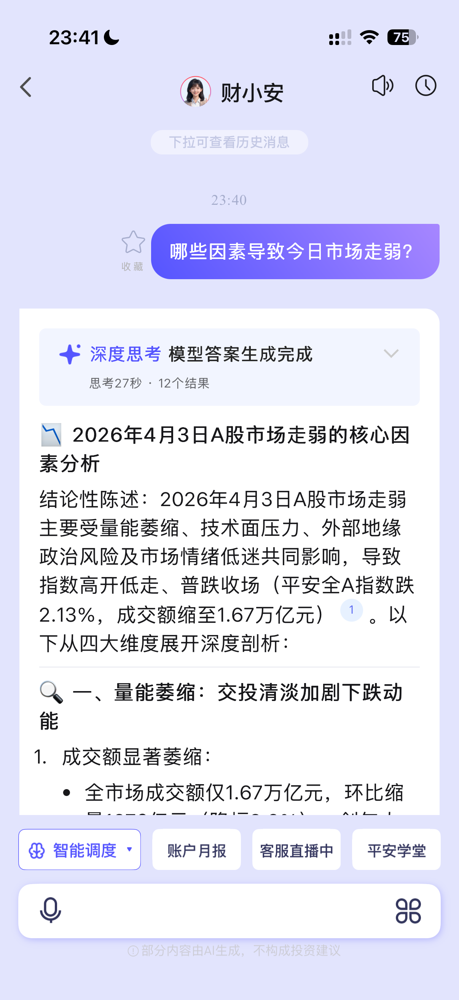
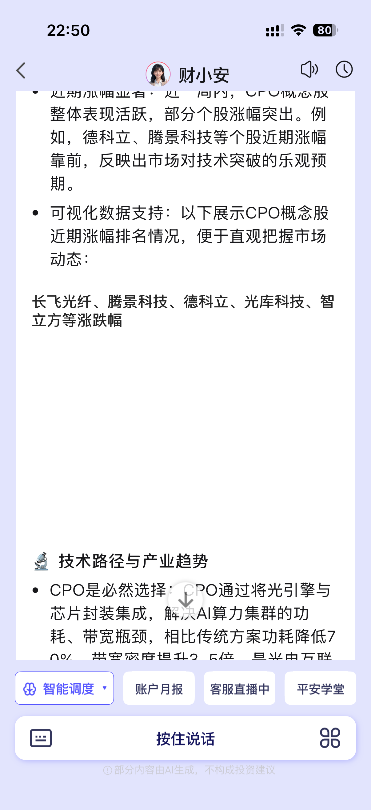

# 平安证券预发布版本体验报告

**体验日期**: 2026-04-06 ~ 2026-04-07  
**体验版本**: 10.6.3  
**体验人员**: 用户体验测试

---

## 一、体验概述

本次对平安证券10.6.3预发布版本进行了全面体验，覆盖选股功能、盯盘功能、持仓查询等核心模块。整体而言，该版本产品架构完整清晰，AI Agent能力迭代明显，用户体验基础扎实，是一个有潜力的AI金融助手雏形。

**整体评分**: ⭐⭐⭐⭐ (4/5)

---

## 二、亮点体验

### 1. 产品架构设计完整清晰
- 核心模块规划合理，选股、盯盘、持仓查询等功能划分明确
- 财小安IP形象统一，品牌识别度高
- 从信息查询到辅助决策的产品思路清晰

### 2. AI能力持续迭代提升
- Agent能力相较于上一版本有明显提升，不再局限于纯对话交互
- 新增Skill功能支持下单等具体操作，向实用型工具迈出重要一步
- 能够理解复杂的金融相关问题，并提供多维度分析（消息面、技术面、情绪面等）
- 引入来源引用机制，试图提升AI回答的可信度和可追溯性

### 3. 用户体验有基础保障
- 界面设计风格统一，财小安形象友好亲和
- 语音播放功能贴心，适合金融资讯的长文本阅读场景
- 历史消息记录完整，方便用户回溯过往分析
- 延伸问题设计合理，引导用户深入探索

### 4. 专业性方向明确
- 针对金融场景做了专门优化，提供涨跌分布、资金走势等专业数据展示
- 试图整合多维度信息（收盘数据、消息面、技术面、情绪面）进行综合分析
- 来源引用设计体现了对金融内容可信度的重视

### 5. 功能创新值得肯定
- 五大选股功能的差异化设计思路正确
- 从纯聊天工具向可执行操作的Agent转型方向清晰
- 财小安频道的产品形态有特色，区别于传统券商APP

---

## 三、问题与改进建议

### 优先级P0 - 亟待修复

#### 问题1：点击引用来源文章导致APP闪退
| 项目 | 内容 |
|------|------|
| **严重程度** | 🔴 严重 |
| **模块** | 盯盘功能 - 来源引用 |
| **时间** | 2026-04-06 23:18 |

**问题描述**: 点击引用来源文章后APP发生闪退，严重影响使用体验。

**复现步骤**:
1. 提问："结合4月03号A股收盘数据和消息面、技术面、情绪面等关键信息，分析市场整体走势的核心驱动因素"
2. 查看财小安的回答，找到「何帆教授"九层股市利益金字塔"理论」段落
3. 点击引用来源"④"
4. 点击引用来源文章

**截图**:     
**闪退视频**: [闪退记录](imgs/ScreenRecording_04-06-2026 23-35-59_1.MP4)

---

#### 问题2：来源引用标注错误
| 项目 | 内容 |
|------|------|
| **严重程度** | 🔴 严重 |
| **模块** | 盯盘功能 - 来源引用 |
| **时间** | 2026-04-06 23:18 |

**问题描述**: 「何帆教授"九层股市利益金字塔"理论」一段引用来源标注为"④"，但点击后看到④的内容与此无关，真正有关的是第九条引用来源。

**建议**: 确保引用编号与内容正确匹配，提高信息可信度。

---

### 优先级P1 - 重要功能完善

#### 问题3：个人持仓信息未接入数据源
| 项目 | 内容 |
|------|------|
| **严重程度** | 🟠 重要 |
| **模块** | 持仓查询 |
| **时间** | 2026-04-07 02:08 |

**问题描述**: 个人持仓信息仍未接入到模型数据源中，无法查询"我都持有哪些股票"。

**复现步骤**:
1. 提问："我都持有哪些股票"
2. 查看财小安的回答

**预期结果**: 模型能够读取并展示用户的个人持仓信息。

**截图**: 

---

#### 问题4：历史消息跳转时丢失时间信息
| 项目 | 内容 |
|------|------|
| **严重程度** | 🟠 重要 |
| **模块** | 盯盘功能 - 历史消息 |
| **时间** | 2026-04-06 23:40 |

**问题描述**: 点击盯盘中历史消息的延伸问题，跳转后未包含历史消息中的时间信息，返回了错误日期的分析结果。

**复现步骤**:
1. 点击盯盘中的一条历史消息（04-02 14:03）
2. 点击午后动向中的延伸问题"哪些因素导致今日市场走弱？"
3. 查看跳转后的财小安提问信息和回答

**预期结果**: 跳转后应包含历史消息中的时间信息（04-02），返回04-02日的市场走弱分析。

**实际结果**: 返回了04-03日的市场走弱分析，与预期不符。

**截图**: 

---

#### 问题5：涨跌分布等数据无法正常展示
| 项目 | 内容 |
|------|------|
| **严重程度** | 🟠 重要 |
| **模块** | 盯盘功能 - 数据展示 |
| **时间** | 2026-04-06 |

**问题描述**: 涨跌分布、总成交额、资金走势内容很快闪过一条"正在总结"文案，然后就显示"暂无数据"。

**预期结果**: 数据正常加载并展示，或显示明确的加载状态，不应出现"正在总结"后立即显示"暂无数据"的情况。

**视频**: [数据展示问题](imgs/ScreenRecording_04-06-2026 23-46-09_1.MP4)

---

#### 问题6：财小安回答样式渲染错误
| 项目 | 内容 |
|------|------|
| **严重程度** | 🟠 重要 |
| **模块** | 选股功能 - 财小安回复 |
| **时间** | 2026-04-06 22:47 |

**问题描述**: 财小安回答中存在样式渲染错误，在两端文字中间空出了大量错误空行。

**复现步骤**:
1. 提问："CPO概念近期投资机会分析"
2. 查看财小安的回答

**预期结果**: 回答内容排版正常，无异常空行。

**截图**: 

---

### 优先级P2 - 体验优化

#### 问题7：语音播放时希望高亮当前句子
| 项目 | 内容 |
|------|------|
| **严重程度** | 🟡 一般 |
| **模块** | 选股功能 - 语音播放 |
| **时间** | - |

**问题描述**: 语音播放回复消息时，希望可以将当前阅读的句子高亮，方便长文本阅读时进行位置定位。

**详细说明**: 很多专业性的分析结果内容中包含大量专有名词和缩写，TTS输出的结果可能会出现错误或与用户预期发音不同的情况，此时可以快速定位到所读句子将可以更好的辅助理解模型输出内容。

**预期结果**: 语音播放时，当前朗读的句子有高亮显示，方便用户跟随阅读。

---

#### 问题8：支持从指定段落开始朗读
| 项目 | 内容 |
|------|------|
| **严重程度** | 🟡 一般 |
| **模块** | 选股功能 - 语音播放 |
| **时间** | - |

**问题描述**: 由于模型回复信息较多，建议支持用户从指定段落开始朗读，避免用户走神漏听后只能完整重头听的窘境。

**建议**: 在长文本回复中，允许用户点击任意段落开始语音播放，或提供断点续播功能。

---

#### 问题9：专业名词语音阅读不够严谨
| 项目 | 内容 |
|------|------|
| **严重程度** | 🟡 一般 |
| **模块** | 选股功能 - 语音播放 |
| **时间** | - |

**问题描述**: 部分专业名词的语音阅读错误，对于专业的金融服务产品不够严谨。

**详细说明**: 例如"ROE"应该三个字母分开阅读（R-O-E），但实际TTS错误地将其作为一个单词朗读。

**建议**: 建立金融专业术语词典，对常见的金融缩写（如ROE、PE、PB、EPS、ROA等）进行特殊处理，确保按字母分开朗读。

---

### 优先级P3 - 细节打磨

#### 问题10：五大选股功能头像区分度不足
| 项目 | 内容 |
|------|------|
| **严重程度** | 🟢 轻微 |
| **模块** | 选股功能 - 财小安频道 |
| **时间** | - |

**问题描述**: 财小安频道选股功能下，五大选股功能的财小安头像区分度不够。

**详细说明**: 当前只有右下角的小图标有区分性，建议头像本身也根据板块特性调整虚拟形象，会更有辨识度一些。

**建议**: 为五大选股功能设计不同的财小安虚拟形象，增强辨识度。

---

## 四、问题统计

### 按严重程度统计

| 严重程度 | 数量 | 占比 |
|----------|------|------|
| 🔴 严重 | 2 | 20% |
| 🟠 重要 | 4 | 40% |
| 🟡 一般 | 3 | 30% |
| 🟢 轻微 | 1 | 10% |
| **总计** | **10** | 100% |

### 按功能模块统计

| 模块 | 问题数量 | 占比 |
|------|----------|------|
| 选股功能 | 5 | 50% |
| 盯盘功能 | 3 | 30% |
| 持仓查询 | 2 | 20% |
| **总计** | **10** | 100% |

---

## 五、总体评价与建议

### 评分原因

**加分项（4分基础）：**
1. 产品架构完整清晰，核心功能模块规划合理
2. AI Agent能力迭代明显，从纯对话向可执行操作转型
3. 新增Skill功能支持下单等具体操作，实用性提升
4. 用户体验基础扎实，界面设计友好统一
5. 专业性方向明确，针对金融场景做了优化

**扣分项（-1分）：**
1. **稳定性问题（-0.5分）**：存在点击引用来源导致APP闪退的严重问题
2. **功能完整性（-0.3分）**：个人持仓信息未接入数据源
3. **数据准确性（-0.1分）**：来源引用标注错误、历史消息跳转时间丢失
4. **专业性细节（-0.1分）**：金融专业术语发音不严谨

### 改进路线图建议

**第一阶段（紧急修复）**：
- 优先解决APP闪退问题，确保应用稳定性
- 修复来源引用标注错误，提高信息可信度

**第二阶段（功能完善）**：
- 接入个人持仓数据源，支持个人持仓查询
- 修复历史消息跳转时间丢失问题
- 修复涨跌分布等数据展示问题
- 修复财小安回答样式渲染问题

**第三阶段（体验优化）**：
- 语音播放增加句子高亮功能
- 支持从指定段落开始朗读
- 优化金融专业术语发音
- 增强五大选股功能头像辨识度

---

## 六、总结

平安证券10.6.3预发布版本整体完成度较高，是一个有潜力的AI金融助手雏形。产品架构完整清晰，AI Agent能力迭代明显，用户体验基础扎实，金融专业性方向明确。

建议优先解决闪退等P0级别严重问题，再逐步完善功能和优化细节，有望达到5分水准。

